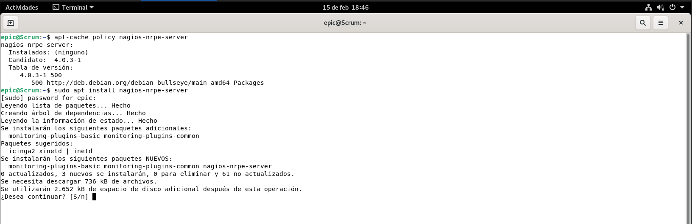
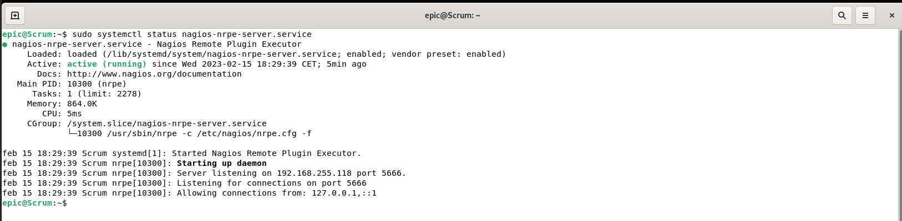

# 4 Instalación de NAGIOS.
## 4.2 Clientes Nagios.
### 4.2.2 Instalación en clientes Linux

La instalación de los agentes Nagios en los distintos servidores con sistemas operativos Linux que vayan a ser monitorizados como el caso de los dos siguientes apartados, es tan simple como la instalación de un paquete. 

Este paquete está disponible para la mayoría de gestores de paquetería linux. En nuesto caso, los dos servidores a monitorizar son Debian. Primero hacemos una búsqueda con `apt-cache policy nagios-nrpe-server` y procedemos a la instalación habitual con `sudo apt install nagios-nrpe-server`

Comprobamos que el servicio está ejecutándose
