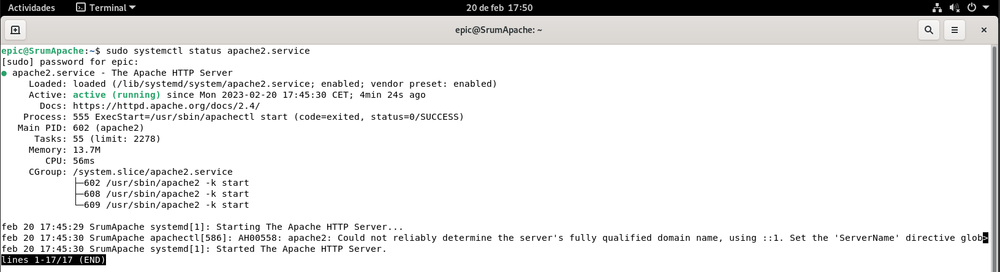

# 4 Instalación de NAGIOS.
## 4.2 Clientes Nagios.
### 4.2.3 Apache en Debian

Otro de los clientes que vamos a monitorizar es un servidor web. Montaremos un servicio Apache sobre un Debian 11. La instalación de Apache es igual que la que hemos hecho para otras asignaruras como Implantación de Aplicaciones Web o Servicios en Red. Solo nos interesa que el servicio esté habilitado y corriendo para su monitorización

## [Volver al Inicio.](../README.md)
