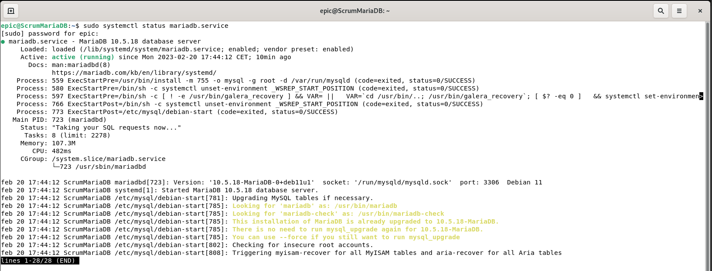

# 4 Instalación de NAGIOS.
## 4.2 Clientes Nagios.
### 4.2.4 MariaDB en Debian

El tercero de los clientes que vamos a monitorizar es un servidor web. Montaremos un servicio Apache sobre un Debian 11. La instalación de Apache es igual que la que hemos hecho para otras asignaruras como Implantación de Aplicaciones Web o Servicios en Red. Solo nos interesa que el servicio esté habilitado y corriendo para su monitorización.

Como hemos mencionado antes, para esta práctica podemos ignorar los avisos en amarillo de systemctl.