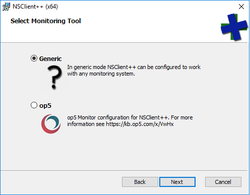
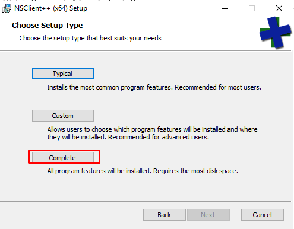
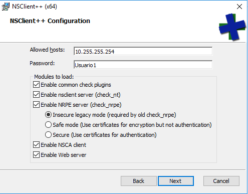
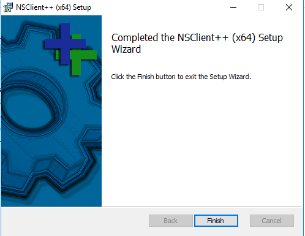
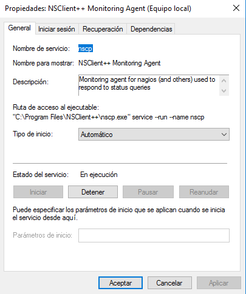
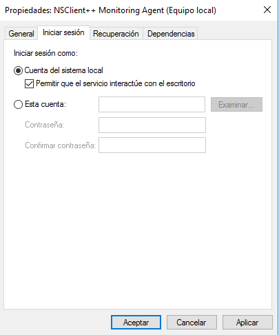

# 4 Instalación de NAGIOS.
## 4.2 Clientes Nagios.
### 4.2.1 Windows 2016.

Como pudimos observar en el punto 2.2, Nagios no tiene soporte para equipos windows, por lo que necesitaremos instalar un cliente que nos permita tener como cliente al equipo en cuestión. Para poder utilizar Nagios en un sistema windows, deberemos utilizar un cliente que encontraremos en el siguiente enlace de [github](https://github.com/mickem/nscp/releases).

La instalación de este cliente es muy sencilla, para empezar descargaremos y ejecutaremos el archivo .msi que encontremos en el repositorio, una vez lo ejecutemos nos aparecerá la pestaña siguiente.

Seleccionaremos la opción generica y continuaremos a la siguiente pestaña y seleccionaremos la opción marcada en rojo

Tras esto tendremos que configurar las opciones para poder permitir al servidor poder acceder al cliente para consultar los datos que necesite para la monitorización.

Cuando hemos terminado, le daremos a finalizar y nos dirigiremos a servicios de windows.

Cuando estemos en servicios buscaremos el servicio NSClient++ y nos iremos a sus propiedades.

Una vez en sus propiedades deberemos irnos a Inicio de sesión y permitir que la cuenta local inicie y que el servicio pueda interactuar con el sistema

## [Volver al Inicio.](../README.md)

